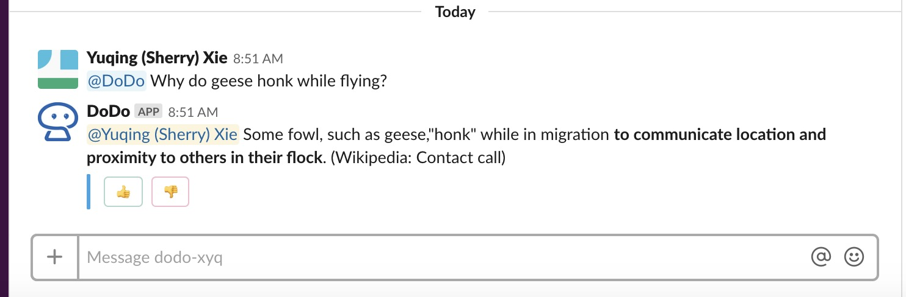
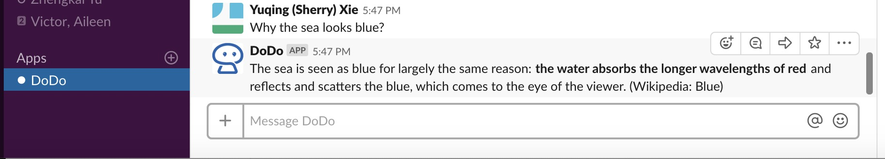

#### You have succesfully add @DoDo to you workspace!

Next step?

To add Dodo to a channel, you can start by @Dodo in the channel. This will invite @DoDo to the channel. 

To ask @DoDo a question, you just have to @Dodo and type the question.

You can also ask @Dodo questions person to person without disturbing others in the channel.

You can just search for @dodo in Apps, and the rest is just like talk to a real person!

#### Enjoy chatting with DoDo!

