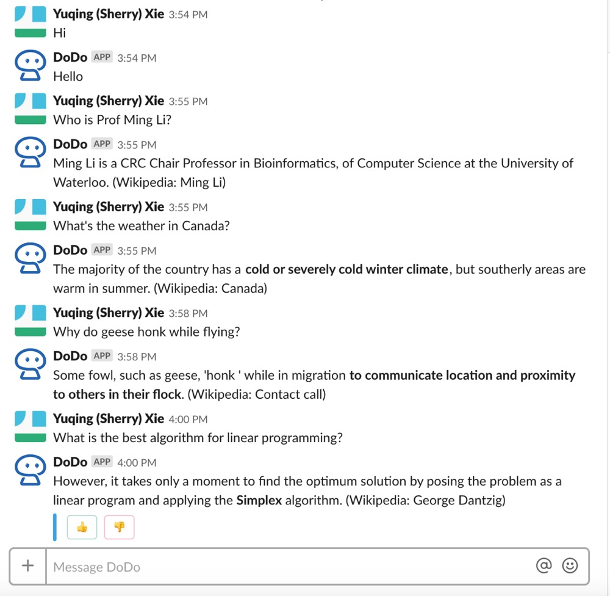

DoDo is a chat bot developed by [RSVP.ai](http://rsvp.ai/en/#/index). It can answer factoid questions according to knowledge learned from Wikipedia.
You can play with either on our [platform](http://dodo.ai/bertserini)
or [install](https://slack.com/oauth/authorize?client_id=293539967155.615345701889&scope=bot) the bot into your workspace in Slack.

### What can DoDo do?

By adding DoDo to your workspace, users can ask the bot any factoid questions during working, chatting.
This will spare users a lot of time and improve working and communication efficiency.

Dodo will find the most relevant paragraph and highlight the most possible phrase. You can also thumbs
 up or down to give us a direct feedback. 
 
If Dodo did not find a convincing answer, it will suggest you other questions to chat with it. 
 
### Paper

If you are interested in the technical [detail](https://amyxie361.github.io/BERTserini/Paper)
, please refer to our research [paper](https://arxiv.org/abs/1902.01718),
which has been accepted by [NAACL 2019](https://naacl2019.org/)

### Contact

Having trouble with BERTserini? 
[Contact us](https://amyxie361.github.io/BERTserini/Contact)
 for further help and suggestions.
